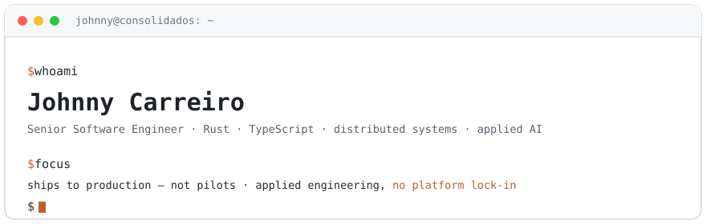

<div align="center">
  <picture>
    <source media="(prefers-color-scheme: dark)" srcset="./assets/hero-dark.svg">
    
  </picture>
</div>

---

### By the numbers

| | |
|---|---|
| **a decade+** | shipping software |
| **billions** | of records in production |
| **+260%** | write performance — UUID v4→v7 migration (custom Rust tool) |
| **self-hosted AI** | in production — privacy-first, no per-message cost |
| **Polkadot / Substrate** | private parachain in production (auditable ESG certification) |

### Selected work

- 🛡️ **[Anatomy of a Contagious Interview](https://consolidados.digital/en/blog/anatomia-contagious-interview)** — I dissected a real malware sample disguised as a job interview (two coordinated payloads, a typosquatted C2). What separates a senior from the target.
- 🧪 **[Open-source analysis sandbox](https://github.com/JohnnyCarreiro/sandbox)** — a dockerized, reproducible environment to detonate samples safely.
- 📊 **[Cases](https://consolidados.digital/en/cases)** — real engagements, anonymized, with numbers (under NDA).
- 🎤 **Talk** — applied AI, Faculdade Franco Montoro (2026).
- 🏢 **[@ConsoliDados](https://github.com/ConsoliDados)** — open methodology, playbooks, and internal tooling.

> _Showcase repos on the way — UUID v7 Postgres benchmark, self-hosted LLM agent (MCP), strangler pattern. Reproducible, with numbers._

### Latest writing

<!-- BLOG-POST-LIST:START -->
<!-- auto-filled from consolidados.digital/blog (GitHub Action) -->
- [Anatomy of a Contagious Interview](https://consolidados.digital/en/blog/anatomia-contagious-interview)
- [Custom WhatsApp chatbot vs a no-code platform](https://consolidados.digital/en/blog/chatbot-whatsapp-sob-medida)
- [UUID v4 vs v7: migrating billions of records](https://consolidados.digital/en/blog/uuid-v4-vs-v7)
<!-- BLOG-POST-LIST:END -->

### Services — via [ConsoliDados](https://consolidados.digital/en/services)

AI agents · AI chatbots · AI automation · tailor-made applications · performance engineering · legacy modernization · embedded senior teams

### Stack

```text
Languages      Rust · TypeScript · JavaScript · Java · PHP · Dart · SQL
Backend        NestJS · Laravel · Node.js · Bun
Frontend       React · Next.js
Mobile         Flutter · React Native
Desktop        Tauri
Architecture   DDD · Clean Architecture · Data-oriented Design · TDD · Microservices · Outbox / event-driven
Data           PostgreSQL (pgvector) · SQL Server · MongoDB · DynamoDB · Redis · Neo4j
Messaging      RabbitMQ · Kafka · AWS SQS/SNS · Redis (BullMQ)
API            REST · GraphQL · gRPC · tRPC
Cloud & infra  Docker · Kubernetes (EKS) · Terraform · Pulumi
AWS            EC2 · ECS · Fargate · ECR · Lambda · S3 · RDS · SQS · SNS · CloudWatch
Observability  OpenTelemetry · Jaeger · Prometheus · Grafana · Loki · Sentry
Testing        Jest · Vitest · Bun test · Cypress · k6
Security       YARA · ClamAV · sandboxing · CTF
Web3           Substrate · Polkadot · Rust pallets · Polygon · Solana
AI             Llama · Mistral · Qwen · DeepSeek · Gemma · GLM · Kimi · MiniMax · OpenAI · Anthropic
               LangChain · RAG · MCP · evals/guardrails · self-hosted (Ollama)
Process        Scrum · Agile · Kanban · Lean · XP
Tools          Jira · Slack · GitHub Actions (CI/CD) · Obsidian
```

<details>
<summary>🇧🇷 Para empresas brasileiras</summary>

<br>

Trabalho **exclusivamente como PJ B2B**, via [ConsoliDados](https://consolidados.digital) ou contrato PJ direto de prestação de serviços.

</details>

### Contact

📧 **[contact@johnnycarreiro.com](mailto:contact@johnnycarreiro.com)**  ·  💼 **[LinkedIn](https://www.linkedin.com/in/johnny-carreiro/?locale=en)**  ·  🌐 **[consolidados.digital](https://consolidados.digital)**
